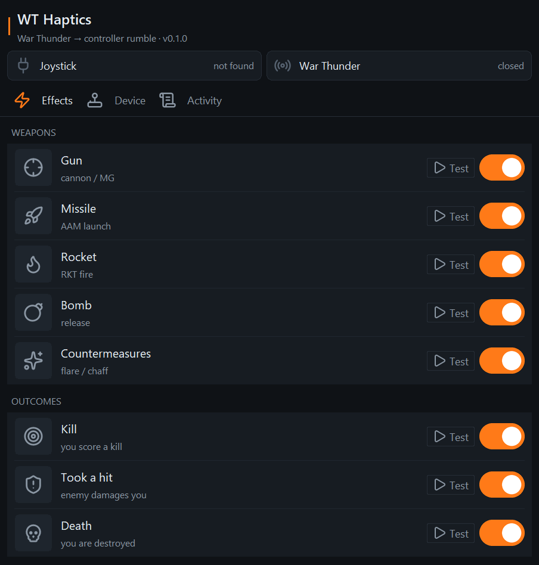

# Warthunder Rumble Support

This app uses visual detection to spot in-game events in War Thunder and translates them into
controller vibration on supported hardware.

Windows only. It reads the game's local telemetry and the on-screen HUD, and sends vibration
to the controller over USB HID. No game files are touched.

<p align="center">
  
</p>

## Supported hardware

| Device | Status |
|---|---|
| Winwing Ursa Minor Fighter | Supported |

More devices can be added. If you want one supported, open an issue.

## Triggers

| Trigger | Fires when |
|---|---|
| Gun | You hold the trigger |
| Missile | A missile launches |
| Rocket | A rocket fires |
| Bomb | A bomb releases |
| Countermeasures | Flares or chaff go out |
| Kill | You destroy an enemy |
| Hit | An enemy damages you |
| Death | You get destroyed |

Guns, kills, hits and deaths can be toggled on or off. Kill, hit and death only fire for you,
so set your in-game callsign in the app.

## Usage

### Download (recommended)

1. Grab the latest `WTHaptics-*-win64.zip` from the
   [Releases page](https://github.com/NolanMullins/WarthunderRumbleSupport/releases/latest).
2. Unzip it anywhere and run `WTHaptics.exe`. No Python needed.
3. The app checks for updates on its own. When a newer release is out, an "Update available"
   banner appears and it can update itself in place (Device tab, Updates).

### Run from source

Windows, Python 3.10+ (64-bit):

```powershell
python -m pip install -r requirements.txt
python run.py
```

### First run

1. Plug in the controller. The **Joystick** status goes green when it's found.
2. Start War Thunder and get into a match. The **War Thunder** status goes green.
3. On the **Effects** tab, switch the triggers you want on or off, and hit **Test** to feel any
   of them.
4. On the **Device** tab, enter your callsign (so kill / hit / death only fire for you) and turn
   on **HUD auto-detect**, which learns your HUD the first time it sees the weapon counters.

If detection looks off, use **Set Region** (Device tab) to box the weapon counters, or
**Re-learn HUD** to redo it.

## How it works

Weapon fires come from reading the HUD ammo counters: when a counter drops, that weapon fired.
A noise filter rejects misreads so only real shots trigger. Gun input and the kill/death feed
come from War Thunder's local telemetry. All of it is sent to the controller over USB HID.

Developer docs:

- [docs/HardSupport.md](docs/HardSupport.md) - adding support for a new controller
- [docs/Build.md](docs/Build.md) - building the standalone exe and the CLI flags
- `tests/` - the detection test suite

Source lives under `src/winwinghaptics/`.
